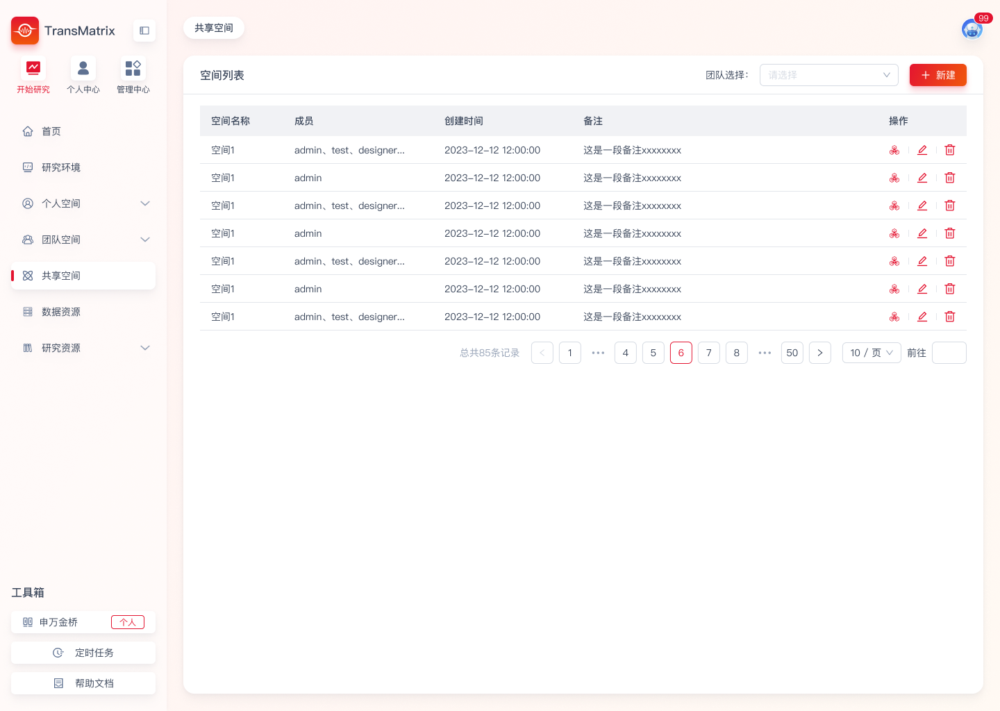
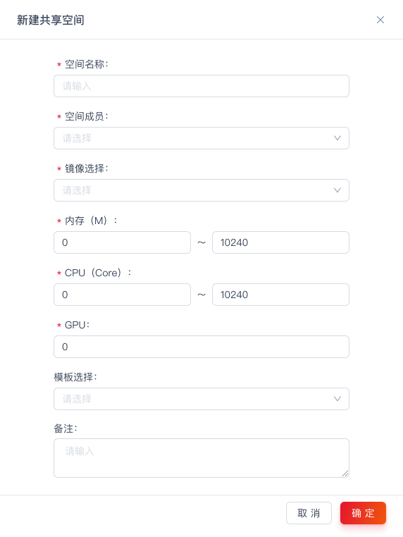
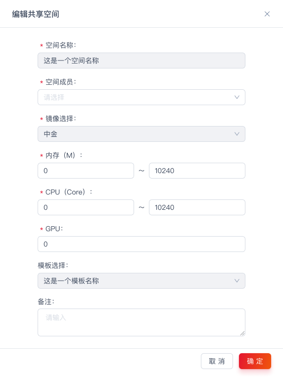
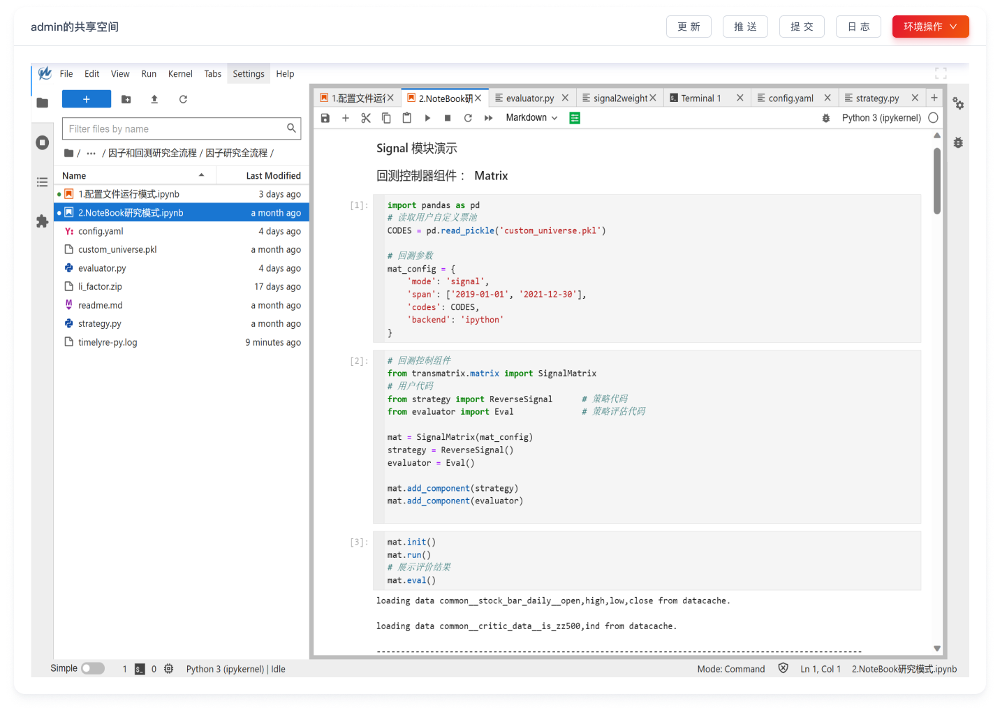
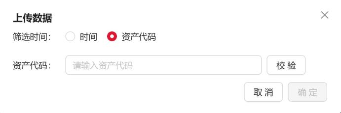

# 概述
系统主要分为三个一级模块，管理中心、个人中心、研究中心。  
- [管理中心](#管理中心)主要为用户体系配置、团队设置、系统层级的设置等  
- [个人中心](#个人中心)主要为个人相关的信息设置、审核发布、消息通知等  
- [开始研究](#开始研究)主要为研究开展的相关功能。包括因子研究、策略研究等

# 管理中心

## 用户管理&组织管理  
创建用户&创建组织为用户开始使用Transquant的第一步。建议对该系统具有管理权限人员使用平台前仔细阅读该部分。
该用户权限管理系统采用了RBAC3（Role-Based Access Control）模型进行设计，可灵活创建多层级组织架构，并支持自由创建团队内的角色页面权限及数据权限，在保证系统的使用简易性上尽可能的增加了用户体系的自由度。  
该功能模块涉及“用户管理”及“组织管理”两个页面。  
__建议__：第一次进行大规模用户创建或新增加一个团队，以以下步骤进行操作：  
- 为所有用户创建用户
- 创建部门/团队
- 为团队创建相应团队角色
- 添加团队成员  
    
   
1. 用户管理  
    1. 如何创建用户  
   Admin账号具备创建用户的权限，可以为用户开设账户，并为用户配置环境等操作。
   Admin账号支持在【管理中心->用户管理->点击添加】  
   在弹框界面输入对应用户信息，用户名必须为不包含特殊字符的纯字母组合。点击确认添加该用户。 密码默认为 666666，账号创建成功后， 用户第一次登录时将强制修改密码。   
   成功创建用户后可对用户进行编辑，支持对用户密码进行重置、修改用户状态、修改用户姓名、邮箱、电话。
 
   

   1. 为用户配置研究环境  
用户在编辑或运行代码时，需要拥有自己独立的环境资源，如CPU、GPU、内存等资源，这时可以在【研究环境】中进行配置。  
在【用户管理】界面，找到需要配置环境的用户，点击操作列下的【配置环境】按钮，点击【添加】按钮来为该用户添加一个环境  
选择需要的镜像→输入自定义的环境名称(实例名称)→填写所需分配的内存、CPU、GPU大小→点击【创建】，此时关闭该界面即可，同时后台就会为该用户创建新的环境，可能需要 2-3 分钟，创建成功或失败后会有相应的提醒  

如果镜像列表中没有镜像，请先在【管理中心->镜像管理】中添加好镜像，具体操作请参考[镜像管理](#镜像管理)

   1. 编辑用户
可修改姓名、邮箱、电话、状态或重置密码。状态包括：正常、停用、挂起。
      - 正常：用户可正常使用平台
      - 停用：停用账户，用户不可登录账户，用户正确输入账户密码验-证码登录时提示该用户”账户已停用“。超级管理员可在之后调整其账户状态至正常/挂起。停用后其个人资源保留。
      - 挂起：用户登录时需强制修改一次密码，新用户自动为挂起状态
  

2. 组织管理  
   用户拥有账号后，需具备角色权限才可进行投研操作。需要为用户配置用户角色。  
   Transquant支持以树形结构创建业务架构。  
   【使用角色】：
    - 超级管理员：可以创建部门/团队、删除部门/团队。
    - 部门负责人、可对负责的部进行创建子部门、团队的操作，并支持对子部门、团队进行操作（修改子部门负责人、子团队所有功能）。
    - 团队负责人：可以修改本团队内的所有设置。
    

   1. 创建团队  
   
        由于此处支持树形结构构建业务架构，但实际多数情况下多数以团队为单位开展业务。所以此处定义了部门（子部门）/团队两种人员集合的类型。  
   【名词解释】  
       - 部门/子部门：部门/子部门仅为构建组织架构存在，部门领导可查看其下级团队内研究成果。部门领导具备子团队管理员权限。  
       - 团队：团队为开展业务存在，以实际开展业务的团队为团队，例如期货部门自营团队。团队具有团队空间，用户可提交研究成果至团队空间供团队成员共享。  
  
     - 创建部门/子部门  
         可创建根部门/各部门下的子部门。  
       - 根部门的创建方式为【管理中心->组织管理->添加部门】  
       - 为部门添加子部门的方式为【管理中心->组织管理->选择部门并右键->添加子部门】可进行添加子部门操作。添加子部门需填写部门名称、选择负责人、选择次要负责人、填写部门介绍，其中，填写部门名称、选择负责人为必填项。同一层级下部门不可重名。不同层级下，部门可重名。
 

    - 创建团队  
  团队为真实开展业务的组织。可以在团队内配置团队镜像、团队模板、配置团队角色并为团队添加成员。  
 团队的创建方式为【管理中心->组织管理->选择部门并右键->添加团队】。添加团队需填写团队名称、选择团队管理员、填写团队介绍、空间名称、团队数据库、配置团队环境，其中，填写团队名称、选择团队管理员、填写空间名称、团队数据库、配置团队环境为必填项。

   1. 创建角色
   可通过该功能进行自定义团队角色及角色权限设置。用户加入团队时需赋予角色及角色权限。
【管理中心->组织管理->点击团队->角色列表->添加】可以自定义添加角色，可以设置角色名称、角色描述、角色权限。权限分为：页面权限、数据权限  
   - 页面权限：可配置页面上最细到二级菜单权限。  
   - 数据权限：配置该角色可读写的数据库、表。该处可选择公共库/团队库。公共库代表公共数据资源，可为该角色配置“select”权限。团队库为该团队内使用/存储的数据，可谓该角色配置"select"、"insert"、"update"、“delete”、"admin"权限  
   

   1. 配置用户  
   当团队角色配置完成后，即可为该团队添加用户。【管理中心->组织管理->点击团队->添加（成员列表）】可以添加团队成员、配置团队角色。添加成功后，该用户自动拥有该角色所拥有的页面、数据权限。
  

   1. 审批设置  
   可通过该功能对因子项目入库/策略项目入库设置相应流程以及相应流程的团队审核员进行。可设置的状态包括：
   - 无需审批：选择无需审批时，审批人为无，可发布人员为团队全员，不可修改。团队成员提交项目时经过前置验证后直接入库，无需审批。
   - 逐层审批：即串行审批，上一级别通过后下一级别才进行审批。
   - 全部通过：即并行审批-全，所有审批员同时进行审批，所有审批员通过后才通过
   - 任一人通过：即并行审批-或，所有审批员同时进行审批，任一审批员通过即通过

	当选择逐层审批/全部通过/任一人通过时：
     - 审批人：多选，可选的人包括团队管理员、该团队所属的部门的管理员、团队成员。当用户选择为逐层审批时，将按照审批人序号顺序进行审批操作。
     - 可发布人员：多选，可选项包括：“团队全员”/团队里各个成员。
   审批发布详情可查看[发布审核入库](#发布审核入库)  
   

    1. 团队环境  
   当以团队为单位进行投研时，需要有团队环境进行运行因子/策略。  
【管理中心->组织管理->点击团队->添加（团队环境）】，选择镜像、填写环境名称、内存、CPU、GPU、选择部署服务器即可添加。同时，此处可以进行镜像固化、镜像下载、删除环境等功能。

   
__【特殊说明】__
   1. 一个用户可以在多个团队，可以有多个角色。其所在团队可以属于不同部门  
   2. 一个部门必须有一个主负责人，可以增加次要负责人。一个负责人可以管理多个部门/团队。

## 审批日志
该功能记录了平台内所有团队的发布审批入库记录。
   【使用角色】：
    - 超级管理员：可以查看所有团队的发布审批入库记录
    - 部门负责人：可以查看所管团队的发布审批入库记录
  为了方便部门/团队负责人对团队的管理，此处可以筛选特定团队，查看特定团队/特定几个团队的发布审批入库记录。
  

## 镜像管理
【管理中心->镜像管理->添加镜像】输入自定义的镜像名称→获取的镜像地址(地址请咨询TransQuant团队)→输入对镜像的描述信息→点击右侧操作列中的保存按钮，此时就成功产生一个新的镜像，并可在为用户配置环境时选择该镜像，具体操作请参考【为用户配置研究环境】
  

## 审计日志
该功能记录了系统重要日志，超级管理员可选择日期区间进行数据导出。
  

## 系统设置  

系统设置页面主要提供对系统层级的相关设置进行管理，包括系统内whl包及系统模板。  
Whl包为系统底层回测框架包，通过该处上传更新的回测框架。系统层级更新后，用户/团队可在镜像内进行升级。  
系统模板为所有用户均可使用的模板，超级管理员可通过此处上传模板，用户在个人空间创建因子/策略项目时即可使用。   
  

# 个人中心
## 个人信息  
用户可在此页面修改本人账户信息、密码、固化镜像、升级环境、重启环境等。  
- 镜像固化：镜像固化将固化用户环境中安装的包。用户点击环境升级时将不会影响用户已固化的其他包。  
- 环境升级：环境升级将更新该环境中的TransMatrix包至管理中心-系统设置中的最新whl版本。更新后将自动进行环境固化。  
- 环境重启：当用户环境出现未知问题时，如无法顺利打开，显示 404 等情况时，可以点击环境重启按钮，手动重新拉起用户环境。

## 发布管理
用户发布/审核的因子/策略项目记录会在该界面进行留存。用户可查看历史发布的状态、并可进行筛选、查询等操作。详情可查看[发布审核入库](#发布审核入库)
  

## 消息通知
用户个人的历史消息均会在此页面进行记录。可以查看历史消息并可快速跳转至该消息对应的操作的界面。
  

# 开始研究
## 首页  
该功能为用户登录至系统后展示的首页。其功能包括了登录欢迎、待办事项、业务信息汇总展示。其中，业务信息汇总包含了“团队”、“个人”板块，作为部门管理员/团队管理员可以查看“团队”页面，所有用户均可查看“个人”页面。
* “团队”板块主要展示以团队为单位，各团队的用户、因子、策略的汇总情况。管理员可以选择团队以及不同的时间区间进行查看。
* “个人”板块主要展示用户个人的因子、策略的开发情况。

## 个人空间   
研究模块主要负责对因子和策略的管理，包含三个部分：因子研究、策略研究、和第三方模块，分别可以实现因子、策略项目的建立、修改、查询，展示对应的因子库、策略库以及详情信息，以及查看系统安装好的 python 包，用户可以在该模块整体性的查看自己的研究成果  
> 项目：因子和策略在底层都是以项目文件夹为单位进行管理的，项目类型被区分为因子项目和策略项目，因子项目在因子研究内建立，策略项目在策略研究内建立。每个项目内可以放置多个因子或策略，项目内写好的因子或策略会被自动展示在对应的因子库和策略库内。TransQuant 建议每个项目视为独立的工程目录，工程所需要的代码文件都存放于项目内。  
### 因子研究  
因子研究包含因子项目列表和因子库两部分，用户可以在界面上新建、修改、删除项目，项目内建立的因子会在因子库中展示  
#### 因子项目列表  
项目列表存放了用户已经建立的因子项目，用户可以在列表中对因子项目进行管理操作。在列表中可以对因子项目进行筛选或排序  

1. 新建项目  
* 点击右上角的新建按钮，新建一个因子项目  

* 可以输入项目名称、选择或新建标签、选择项目模版，项目模板是预置的因子代码，用户可基于该代码撰写自己的因子项目代码，模板可在管理中心中进行配置，信息输入完成后，点击确认即可生成该因子项目  
2. 文件列表  
* 点击项目操作项下的文件列表，可以快速查看该因子项目下的文件，点击文件后可快速跳转至研究环境中查看源码  

3. 发布  
* 请查看项目发布流程  
4. 描述文档  
* 点击项目操作向下的描述文档按钮，可以快速查看该因子的描述文档，点击打开可以在研究环境中打开该描述文档，对文档进行编辑  
  
5. 编辑  
*  操作项下更多中，编辑操作可以对项目信息进行编辑，可修改标签和备注  
  
6. 删除  
* 操作项下更多中，删除操作可直接删除项目，需要再次确认才可以删除项目  
  
#### 因子库  
当用户在项目中编辑好符合框架规则因子文件如 yaml、运行计算了因子、或执行了因子评价，该因子及相关信息都会在因子库中进行展示，和因子项目一样，可在因子库中对各项指标进行搜索或排序  

1. 查看因子详情
* 点击操作项下的查看详情按钮，可以查看该因子的详情信息，因子详情展示了用户通过 evaluator 模块配置的自定义图表和指标信息  

#### 增量跟踪
当完成了因子项目的编写后，TransQuant支持从项目层级对因子进行跟踪计算

需要填写任务名称、指定入口文件、环境、历史回测开始时间、选择调度时点。
* 指定入口文件是指需要指定一个yaml文件作为入口去进行回测。
* 选择环境指当运行该增量回测时，需要有一个容器去进行运行，定时调度时将使用该环境的镜像启动一个容器去进行运行
* 历史回测开始时间指这个任务设定后从哪一天开始运行回测
* 调度时间指每日几点进行增量的回测，调度时间仅支持17：00-9：00，进行调度
  

设置因子增量计算后，将启动因子增量计算，存储因子数据及增量计算的日志。支持用户查看详情。用户可选择重新运行、结束或删除该增量计算。并支持查看该项目文件代码及调度任务所产生的调度日志、执行日志、运行日志
  
  
   

### 策略研究
与因子研究类似，策略研究包含策略项目列表和策略库两部分，用户可以在界面上新建、修改、删除项目，项目内建立的策略会在因子库中展示  
#### 策略项目列表  
项目列表存放了用户已经建立的策略项目，用户可以在列表中对策略项目进行管理操作。在列表中可以对策略项目进行筛选或排序  
  
1. 新建项目  
* 点击右上角的新建按钮，新建一个因子项目  
  
* 可以输入项目名称、选择或新建标签、选择项目模版，项目模板是预置的策略代码，用户可基于该代码撰写自己的策略项目代码，模板可在管理中心中进行配置，信息输入完成后，点击确认即可生成该策略项目  
2. 文件列表  
* 点击项目操作项下的文件列表，可以快速查看该策略项目下的文件，点击文件后可快速跳转至研究环境中查看源码 (下图为因子项目的文件列表示例，策略项目与其一致)  
  
3. 发布  
* 请查看项目发布流程  
4. 描述文档  
* 点击项目操作向下的描述文档按钮，可以快速查看该策略的描述文档，点击打开可以在研究环境中打开该描述文档，对文档进行编辑(下图为因子项目示例，策略项目与其一致)  

1. 编辑  
*  操作项下更多中，编辑操作可以对项目信息进行编辑，可修改标签和备注  

2. 删除  
* 操作项下更多中，删除操作可直接删除项目，需要再次确认才可以删除项目(下图为因子项目示例，策略项目与其一致)  

#### 策略库
当用户在项目中编辑好符合框架规则策略文件如 yaml、运行计算了策略、或执行了策略评价，该策略及相关信息都会在策略库中进行展示，和策略项目一样，可在策略库中对各项指标进行搜索或排序  

1. 查看策略详情  
* 点击操作项下的查看详情按钮，可以查看该策略的详情信息，策略详情展示了用户通过 evaluator 模块配置的自定义图表和指标信息   
* 收益详情  

* 持仓详情  

* 账户详情  

* 订单详情  

#### 增量跟踪
当完成了策略项目的编写后，TransQuant支持从项目层级对策略进行跟踪计算

需要填写任务名称、指定入口文件、环境、历史回测开始时间、选择调度时点。
* 指定入口文件是指需要指定一个yaml文件作为入口去进行回测。
* 选择环境指当运行该增量回测时，需要有一个容器去进行运行，定时调度时将使用该环境的镜像启动一个容器去进行运行
* 历史回测开始时间指这个任务设定后从哪一天开始运行回测
* 调度时间指每日几点进行增量的回测，调度时间仅支持17：00-9：00，进行调度
  

设置策略增量计算后，将启动策略增量计算，存储策略数据及增量计算的日志。支持查看详情。用户可选择重新运行、结束或删除该增量计算。并支持查看该项目文件代码及调度任务所产生的调度日志、执行日志、运行日志
用户可查看策略增量计算的记录、并可进行筛选、查询。支持对用户对策略增量计算进行设置标签、重新运行、结束、删除等操作。

  
   
   
  
   

### 第三方模块  
第三方模块会展示 TransQuant 平台中已安装好的 python 包，用户可以自行搜索查看  
  

## 发布审核入库  
Transquant量化平台提供了完善的发布审核功能，用户可以将研究完成的因子/策略发布到所属团队中，团队审核员审核完成后可以供团队进行研究/使用。
支持的审批流程包括：
   - 无需审批：选择无需审批时，审批人为无，可发布人员为团队全员，不可修改。团队成员提交项目时经过前置验证后直接入库，无需审批。
   - 逐层审批：即串行审批，上一级别通过后下一级别才进行审批。
   - 全部通过：即并行审批-全，所有审批员同时进行审批，所有审批员通过后才通过
   - 任一人通过：即并行审批-或，所有审批员同时进行审批，任一审批员通过即通过

### 提交发布
在个人空间，点击因子项目列表或策略项目列表中，操作项下的发布按钮，以下流程将以因子发布为示例，策略项目发布与因子项目发布流程一致
1.填写项目名称并选择团队
* 项目名称：希望在团队空间看到的项目名称，无法发布与团队空间中重名的项目
* 团队：希望将该项目发布至的团队，如果不具备发布权限，会进行报错

2. 点击下一步，继续填写项目信息，权限设置中，默认对管理员及以上管理角色均有查看和下载权限

3. 点击下一步，再次确认所提交文件生成的因子，点击发布，该项目会进入审核流程

### 发布管理
在个人中心-发布管理页面可以查看已发布的项目，作为审核员也可以对所负责审批的发布项目进行审批

#### 申请记录

1.在发布管理界面中，可以查看自己的发布申请记录，申请记录已列表的方式呈现，可以进行搜索、筛选、及查看详情。
* 每个发布的项目有三种状态
> * 审核中：表示该项目正在被审核员审核
> * 入库：表示该项目已成功发布至团队空间，可前往进行查看
> * 驳回：表示该项目被审核员驳回，发布失败

2. 点击操作项下的查看详情按钮，可以查看某次发布的详情
* 点击文件保存，可将发布的项目文件保存至个人空间中，等同于新建一个新的个人空间项目

1. 点击描述文档 tab，可以查看该项目的描述信息

1. 点击因子列表 tab，可以查看给项目的因子信息，如果是策略申请，则可以查看策略列表。

* 点击操作栏下的详情按钮，可以查看因子/策略的详情信息

#### 审核记录
1. 在发布管理界面中，作为团队的审核员，可以查看自己负责的审批记录，审批记录以列表的方式呈现，可以进行搜索、筛选、及查看详情。

2. 在操作项下，点击打开待审核的的发布项目，可对该项目进行审批

1. 在检查过发布信息、项目信息后，可选择通过或者驳回，如果选择通过，则该项目将在团队空间中生成，此时需要再次确认项目信息及权限

1. 如果选择驳回，则可以填写驳回原因，确认后发布人将在申请记录中看到该项目发布已被驳回，并看到驳回原因

## 团队空间  
团队空间主要存放了团队中各个成员通过发布功能发布的各个策略和因子项目，和个人空间类似，团队空间分为因子研究和策略研究，因子研究中包含因子项目和因子库，策略研究中包含策略项目和策略库。  
> * 在团队空间中，普通成员用户可以查看/下载自己所具备权限的因子或策略项目  
> * 团队管理员及以上可以查看/下载团队中所有的项目，并且具备文件目录的操作权限  
### 因子研究  
因子研究包含因子项目列表和因子库两部分，团队成员发布的因子项目会在这里展示和管理  
#### 因子项目列表  
项目列表存放了用户已经发布的因子项目，成员用户只能看到自己有可查看权限的团队因子项目，管理员可以在列表中对因子项目进行管理操作。在列表中可以对因子项目进行筛选或排序。  
  
1. 文件列表
* 管理员及以上用户可对团队空间项目中的文件进行操作，选择需要查看的文件，点击可直接跳转至研究环境中进行打开。非管理类角色则无法文件目录操作权限  
2. 描述文档  
* 点击操作项下描述文档按钮则可以查看该因子的描述文档，管理类角色还可以进一步点击打开按钮跳转至研究环境编辑文档   

3. 编辑
* 管理类角色点击操作项下的更多-编辑按钮，可对该项目信息进行编辑。编辑中可以调整该项目的权限、标签、和备注信息

4. 下载
* 具备下载权限的角色点击操作项下的更多-下载按钮，可将项目保存至个人空间，此时会创建一个新项目，输入完项目名称、标签、备注后，点击确定，该团队空间中的项目文件则会保存至刚才创建的个人空间项目中

#### 因子库
和个人空间因子库类似，因子库会展示团队因子的各项指标以及详情信息，只有具备对应因子项目权限的用户才能查看团队库中的因子，在因子库中也可以对各项指标进行搜索或排序  
  
1. 查看详情
* 点击操作项下的查看详情按钮，可以查看该因子的详情信息  

2. 标签设置  
* 管理类角色可以设置团队因子库的标签  
  

#### 增量跟踪
 支持对团队内的因子项目启动增量跟踪。支持对该团队具有管理权限的人员进行启动，该团队内所有成员均可看到该增量任务的情况与表现。其余逻辑均与[增量跟踪](#增量跟踪)一致
  

### 策略研究
策略研究包含策略项目列表和策略库两部分，团队成员发布的策略项目会在这里展示和管理  
#### 策略项目列表  
项目列表存放了用户已经发布的因子项目，成员用户只能看到自己有可查看权限的团队策略项目，管理员可以在列表中对策略项目进行管理操作。在列表中可以对策略项目进行筛选或排序。    

1. 文件列表  
* 管理员及以上用户可对团队空间项目中的文件进行操作，选择需要查看的文件，点击可直接跳转至研究环境中进行打开。非管理类角色则无法文件目录操作权限  
2. 描述文档  
* 点击操作项下描述文档按钮则可以查看该策略的描述文档，管理类角色还可以进一步点击打开按钮跳转至研究环境编辑文档  
  
3. 编辑  
* 管理类角色点击操作项下的更多-编辑按钮，可对该项目信息进行编辑。编辑中可以调整该项目的权限、标签、和备注信息 （下图为编辑因子项目，编辑策略项目与其类似）    
  
4. 下载  
* 具备下载权限的角色点击操作项下的更多-下载按钮，可将项目保存至个人空间，此时会创建一个新项目，输入完项目名称、标签、备注后，点击确定，该团队空间中的项目文件则会保存至刚才创建的个人空间项目中    
  
#### 策略库  
和个人空间策略库类似，策略库会展示团队因子的各项指标以及详情信息，只有具备对应策略项目权限的用户才能查看策略库中的策略，在策略库中也可以对各项指标进行搜索或排序   
  
1. 查看详情  
* 点击操作项下的查看详情按钮，可以查看该策略的详情信息，策略详情展示了用户通过 evaluator 模块配置的自定义图表和指标信息   
* 收益详情  
  
* 持仓详情（下图为个人空间中的持仓详情，团队空间与其一致）   

* 账户详情（下图为个人空间中的账户，团队空间与其一致）   

* 订单详情（下图为个人空间中的订单详情，团队空间与其一致）  

2. 标签设置
* 管理类角色可以 在策略库中设置团队策略的标签  

#### 增量跟踪
 支持对团队内的策略项目启动增量跟踪。支持对该团队具有管理权限的人员进行启动，该团队内所有成员均可看到该增量任务的情况与表现。其余逻辑均与个人空间一致
  

## 共享空间
在该空间内，共享空间的成员可以共同编写代码，并且可以对代码进行版本管理。

### 新建共享空间
**团队管理员**可以创建团队的共享空间。每个团队管理员最多创建5个共享空间。
* 创建时需填写共享空间名称、选择空间成员、选择镜像、填写内存、CPU的上限、填写GPU、选择模板、填写备注进行创建。 
* 创建成功后将发送消息至空间成员。成员共享空间内出现该共享空间。

### 编辑共享空间
  点击编辑按钮，**管理员**可以对共享空间进行编辑。
   * 仅支持编辑空间成员、设置内存、CPU上下限、设置GPU、填写备注。
  
  

### 启动共享空间
共享空间成员可共同在该空间内进行编写代码、更新、推送、提交以及查看日志等操作。
1. 更新
  共享空间成员可以拉取主分支最新代码下来(即git pull)。
1. 编写代码
   当共享空间创建完成后，用户即可打开空间进行代码编写操作。
   
2. 推送
   点击“推送”，代码进行合并。
3.  提交
  当用户完成代码编写后，可以将代码提交上去。(即git add + commit)
      * 提交时可填写提交说明。
       * 提交后，团队成员将收到消息提醒。
       * 若用户修改代码但未及时提交，启动该共享空间时将进行弹窗提醒，且不支持进行“更新”以及“推送”操作。
> 执行更新、提交等操作时可能出现代码冲突的情况。出现冲突时，将弹框提示冲突文件及冲突内容。用户需要解决完冲突之后才可以继续进行更新/提交等操作
4.  日志
  图形化展示分支及分支合并的过程，以及展示哈希值、操作人、操作时间
      * 若用户想还原至历史版本，点击“回退”，可对代码进行回滚操作
  
5. 环境操作
   为保证共享空间内，用户使用一样的环境进行开发，此处维护一份镜像。当共享空间内的成员启动共享空间时，将使用该镜像进行环境启动。
   1. 固化环境
      一个用户固化环境产生了一个最新的镜像后，会提醒其他成员该共享空间的镜像已经更新。当用户重启环境或者启动该共享空间时将使用最新的镜像进行启动。
   2. 重启环境
      当环境崩溃或者其他成员固化环境后，可进行重启操作。
   3. 环境升级
      当TransMatrix包更新时可对该环境进行升级，当其中一个用户升级环境后，会自动固化环境并产生一个最新的镜像，将会提醒其他成员该共享空间的镜像已经更新。当用户重启环境或者启动该共享空间时将使用最新的镜像进行启动。

### 删除共享空间
点击删除按钮，**管理员**可以删除共享空间。

### 关闭共享空间
用户可以关闭共享空间，不会影响空间内代码及操作。  

   

## 数据资源
数据资源中展示了TransQuant 平台已存续的数据资源，数据资源分为三个部分：公共资源、团队空间、个人空间  
> * 公共资源：所有 TransQuant 平台用户都可以接触到的数据，一般会存放行情、财报等数据  
> * 团队空间：每个团队的专有数据，团队用户只能看到自己所在团队的数据资源  
> * 个人空间：每个用户的专有数据，用户只能看到自己的数据  

  
### 信息栏
   * 标签：用户可以增加、删除、修改、查询标签
   * 备注：用户可以对表编写备注并保存。
### 表详情
在数据资源中搜索目标数据表，展示具体某张表的列信息、数据采样、和建表语句

### 数据管理
   用户可以对表中数据进行上传与下载的操作，展示用户上传记录，状态包含上传成功，上传失败，上传中。
   
   1. 上传
      * 用户对该表拥有insert权限时可进行上传
      * 提供示例模板，用户可以点击“模板下载”，按该模板填写后再进行上传
      * 上传成功后，若时序表的建表语句中timelyre.timestamp.col  和 timelyre.tag.cols的值一致，则进行数据覆盖；若不同或没有该字段，则新增数据。
     
   2. 下载
      用户对该表拥有select权限时可下载该表，下载条数最大限制为50万条。
      * 当该表内有datetime字段时，选择时间区间，进行校验，若未超过最大条数限制即可点击确认导出；若超过最大条数限制，请更改条件后再进行校验。  
  
      
       * 当该表内有code字段时，输入资产代码后进行校验，若未超过最大条数限制即可点击确认导出；若超过最大条数限制，请更改条件后再进行校验。  
  
      
       * 当该表内无datetime或code字段时，支持全量导出。

## 研究资源
### 公共因子
该功能展示了平台内已有的因子代码，编写因子时可参考该部分因子进行因子编写。支持复制代码，或将因子项目打包下载至个人空间。

## 工具箱

### 环境切换

该处可切换使用的环境。个人所拥有的环境可在[个人信息](#个人信息)中查看。团队环境可在[团队管理](#用户管理组织管理)中查看

# 修订记录
  
| 版本 | 修订日期 | 修订内容  |
| ---- |--- | --- |
| V2.2.2  | 2023.09.09 | 1.更新用户管理与权限功能，由原本平铺型团队设置修改为树形架构，可支持常见架构/类型团队。优化角色页面权限配置、角色数据权限配置。    2. 修改admin账号权限。 admin账号可进行账号开设、镜像管理、查看审计日志、操作系统设置等，无法修改团队相关设置，包括团队成员、团队角色、团队等    3. 优化个人因子库、个人策略库展示。由原本需进行evaluator运行后进入因子/策略库修改为用户因子/策略编写完成即进入个人因子/策略库。    4. 优化个人因子库、个人策略库指标排序筛选功能，由只可以单页筛选/排序优化至可进行全量筛选/排序。   5. 优化发布审批入库流程，增加携带因子/策略的检验信息进行审批。  6. 优化团队因子库、团队策略库展示 7.增加消息通知功能，包括即时通知以及历史消息|
| V2.3.0 | 2023.9.28 | 1. 增加首页功能，该功能为用户登录至系统后展示的首页。其功能包括了登录欢迎、待办事项、业务信息汇总展示。2.增加公共因子库功能，展示系统内置因子的代码  |
| v2.3.1 | 2023.10.31 | 1. 优化审批功能，支持多人审批方式，审批方式可选择为无需审批、逐层审批、全部通过、任一人通过。2. 在个人空间、及团队空间增加因子增量跟踪、策略增量跟踪功能，支持用户定时进行任务调度对研究成果进行持续跟踪 |
| v2.4.0 | 2023.11.15 | 1. 增加数据资源中备注功能。 2. 支持可视化方式进行数据的上传与下载 3. 增加共享空间功能，支持团队管理员创建，打开，编辑，删除共享空间，以及进行空间内代码的更新，提交，推送，日志回滚等操作|
